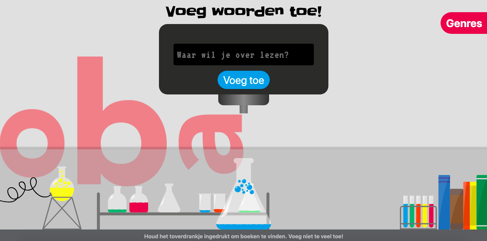
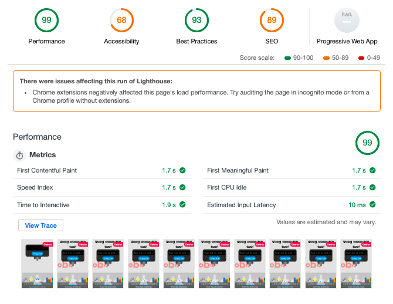

# Performance Matters @cmda-minor-web · 2018-2019
### Jesse Dijkman

For this course, we're going to enhance the performance of our earlier created [apps for the OBA (library of Amsterdam)](https://github.com/jesseDijkman1/project-1-1819).

## Process

> Project 1 final product

To improve the performance of the oba-lab app, I felt like I needed to start from scratch. Because I created the app in just 1 week and so I wrote a lot of spaghetti. But looking at the audits I didn't see extreme issues. (see below)


> Project 1 final product audits result

---

The first thing I did was ... start from scratch. With my main focus on making everything server-sided. And to accomplish this I learned a trick from [Declan](https://github.com/decrek) to use `<input type="hidden">`. And after some styling I eventually ended up with something similar to my project 1 app. (see below)


> Final look of the optimized app

Although I tried to recreate the entire app, I didn't have the time, and having those fancy animations weren't my priority. I mainly focussed on making the app accessible and complety server-sided, with the help of ejs. I even made the loadscreen server-sided. And to make it accesible just used correct HTML.

The things I left out are:
- Looking for books by holding the main potion down with your cursor (which creates an explosion animation).
- Droplet effect when adding a word.
- No fancy animation when adding a genre.

And with this version of the app I did another audit test.

> Audit test after making the oba-lab app accessible

----

## Minification
After making the app accessible and server-sided I added gulp for minifying javascript and css.

For minifying JavaScript I used `gulp js:min` with the following code:

```js
gulp.task("js:min", () => {
  return gulp.src("src/js/*.js")
    .pipe(uglify())
    .pipe(gulp.dest("public/js"));
});
```

For minifying CSS I used `gulp css:min` with the following code:

```js
gulp.task("css:min", () => {
  return gulp.src("src/css/*.css")
    .pipe(cleanCSS())
    .pipe(gulp.dest("public/css"));
});
```

