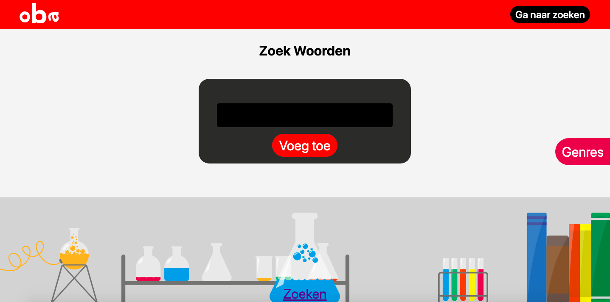
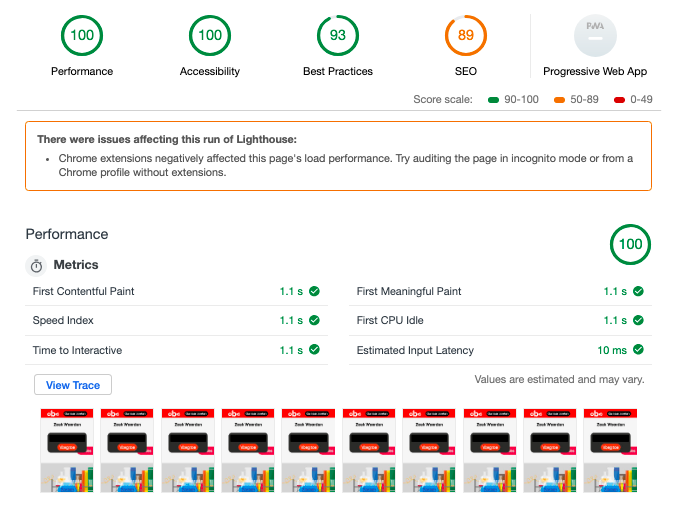

# Performance Matters @cmda-minor-web · 2018-2019
### Jesse Dijkman

## Intro
For this course we're going to improve the performance of the apps we created for the previous project. 

## Table of Contents
- Getting started
  - Installation
  - Running
- To-Do
- Process
  - Week 1
  - Week 2
  - Week 3
- Improvements
  - Server-side rendering
  - Accessibility
  - Minification
  - Caching
  - Progressive Web App


## Getting Started
### Installation
- `git@github.com:jesseDijkman1/performance-matters-1819.git`
- `cd performance-matters-1819`
- `npm install`

### Running
`npm start`

---

## To-Do
For this course I'm not only going to focus on performance but also accessibility. To make the app more accessible I'm going to render everything on the server so the user always gets HTML, so they can use the website even without JavaScript and CSS. And I'm going to use correct HTML so the user could use it with a screenreader.

---

## Process
I didn't work on Performance-matters every week, because I also had another course ([browser-technologies](https://github.com/jesseDijkman1/browser-technologies-1819)) for which I was creating a [server-sided Pong-game](https://github.com/jesseDijkman1/pong-game). Which was the most difficult case of them all. So a lot of my time went to that course.

### Week 1
In week 1 I focussed on making the app server-sided. So everything needed to be rendered on the server. So no client-side javascript fetch requests. And no DOM manipulation. But to actually make it server-sided I had to change so many things about code, which was all spaghetti (because it was written in 5 days). So I just started from scratch (which I don't recommend, but I have the habit of doing it). To make the app server-sided it immediately created some challenges like:
- How am I going to let users add words and genres
- How am I going to let users search for books

Because these two things we're all done with fancy JavaScripts, like letting users search by holding down the main potion with their cursor (which creates an animation).

To let users add words and genres, I used `<input type="hidden">`. For storing previous entered values. And with the combination of EJS it worked.

```ejs
<form class="form-word add" method="POST" action="/submitWord">
  <input name="wordsBundle" type="hidden" value="<%= words %>">
  <input name="genresBundle" type="hidden" value="<%= genres[0] %>">
  <label for="wordAdd" class="visuallyhidden">Voeg een woord toe</label>
  <input id="wordAdd" name="dataWord" type="text">
  <button type="submit">Voeg toe</button>
</form>
```

And with some CSS it eventually looked close to the original.

> Adding-words-page, without JavaScript

And looking at the audits for this stage, I think it worked


### Week 2 & 3
I focussed on browser-tech during these two weeks.

---

## Improvements
### Server-side rendering
The biggest influencer I think, is the rendering. The original version was completely client-side, because that was part of the assignment. So I made everything server-sided, like:
- Loading page
- Page for adding words
- Page for adding genres
- List page
- Detail page

To achieve the loading page I learned about a cool meta tag: 
```html
<meta http-equiv="refresh" content="0;url=<%= callBackUrl %>" />
```

combined with the following code:

```js
function loader(req, res) {
  return new Promise((resolve, reject) => {
    const hasParams = Object.keys(req.query).length;

    if (!req.query.loading) {
      if (!hasParams) {
        req.url += "?loading=true";
      } else {
        req.url += "&loading=true";
      }

      const fullUrl = `https://${req.get("host")}${req.url}`;

      res.render("loading.ejs", {callBackUrl: fullUrl});
    } else {
      resolve();
    }
  });
}
```

### Accessibility
To make everything server-sided I also made everything accessible, this means that everyone on every device can visit the page. There's no JavaScript or CSS needed. Also the HTML is correct, there are labels, forms and a-tags.

### Minification
To minify the JavaScript and CSS I used the following packages:
- [gulp](https://www.npmjs.com/package/gulp)
- [gulp-concat](https://www.npmjs.com/package/gulp-concat)
- [gulp-uglify-es](https://www.npmjs.com/package/gulp-uglify-es)
- [gulp-clean-css](https://www.npmjs.com/package/gulp-clean-css)

And the following code:
```js
const gulp = require("gulp"),
      gulpConcat = require("gulp-concat"),
      uglify = require("gulp-uglify-es").default,
      cleanCSS = require("gulp-clean-css");

gulp.task("js:min", () => {
  return gulp.src("src/js/*.js")
    .pipe(uglify())
    .pipe(gulp.dest("public/js"));
})

gulp.task("css:min", () => {
  return gulp.src("src/css/*.css")
    .pipe(cleanCSS())
    .pipe(gulp.dest("public/css"));
});
```

### Caching
### Progressive Web App
